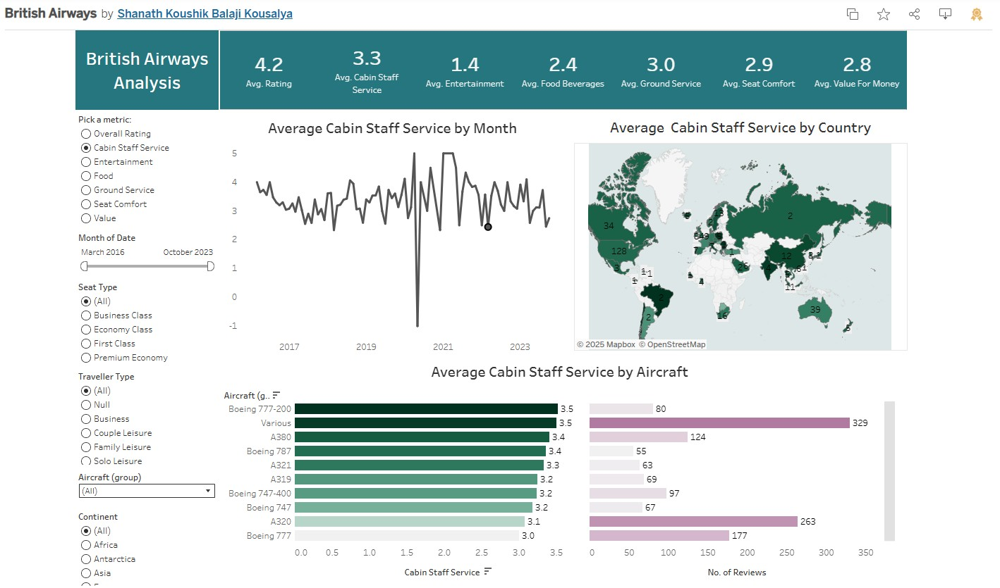

# British Airways Customer Reviews Dashboard ✈️

## 📌 Project Overview
This project visualizes **British Airways customer reviews** using Tableau.  
It covers multiple aspects of the flying experience:
- Overall rating
- Value
- Food & beverage
- Entertainment
- Ground service
- Cabin service

## 📊 Dashboard Features
- 🌍 **Global Map** – Ratings across continents by category  
- 📈 **Trend Analysis** – Ratings over time (month/year filters)  
- 🛫 **Aircraft Type Analysis** – Ratings vs. aircraft types and review counts  
- 🎛️ **Interactive Filters** – Filter by flight class, location, solo travel, aircraft type, and more  

## 🔗 Explore the Dashboard
👉 [View on Tableau Public](https://public.tableau.com/shared/25XS5JHSS?:display_count=n&:origin=viz_share_link)

## 🖼️ Dashboard Preview

## ⚙️ Tools Used
- Tableau Public  
- GitHub (for documentation and project sharing)  

---
